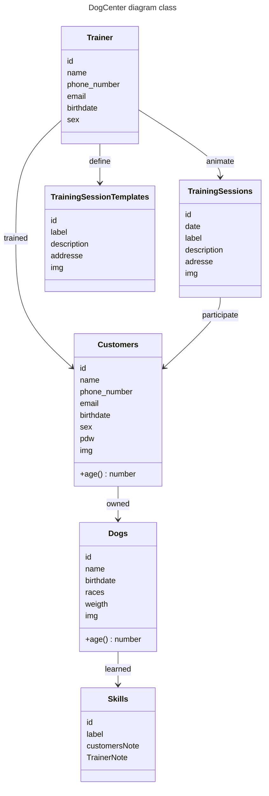

# Dog center

Dog center purpose is to display an interface for `DogTrainer` to manage their `TrainingSessions` and their `Customers`.

`Customers` will be allowed to create an account and manage their dog profile.

`DogTrainer` (admin) will display training sessions in a planning.

`Customers` will ask to join sessions. `DogTrainer` have to confirm them.

`Customers` and `DogTrainer` will be notified with email/sms.

`DogTrainer` can set up `TrainingSessions` by themself with `Customers`.

## Models



## Project architecture

`DogCenterApi` is based on clean architecture pattern.

`Entities`: business logic
`Use Cases`: business services
`Interfaces/Adapters`: web handlers, implement repositories
`Infra`: db
`Main`: entry point and config

```css

src/
├── main.rs
├── entities/
│ └── user.rs
├── use_cases/
│ └── user_service.rs
├── interfaces/
│ └── http/
│   ├── handlers.rs
│   └── routes.rs
├── infra/
│ └── db/
│   └── user_repository.rs
├── repositories/
│   └── user_repository.rs
└── shared/
  └── error.rs
```
